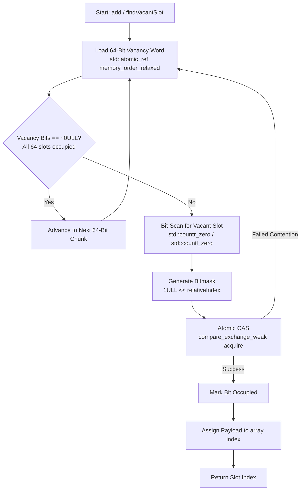
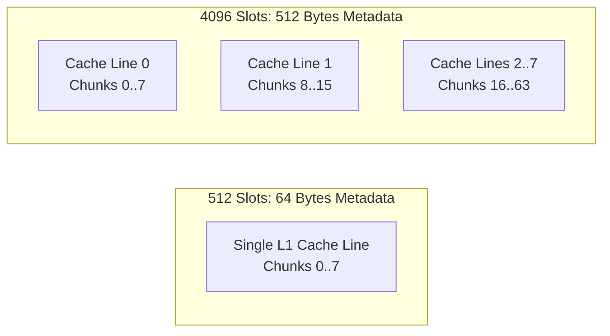

# ArraySlotThreadSafe

A header-only C++20 thread-safe array slot manager. It tracks slot allocation state using lock-free bitmask operations, offering deterministic lookup and zero heap allocations during operation.

## Key Features

* **Bitmask Metadata:** Tracks slot availability at 1 bit per slot (8 bytes per 64 slots).
* **Lock-Free Allocations:** Uses `std::atomic_ref` with C++20 bit-scanning hardware intrinsics (`std::countr_zero` / `std::countl_zero`).
* **Cache-Aware:** Metadata for up to 512 slots fits within a single 64-byte L1 cache line. Larger slot counts naturally spread across multiple cache lines with zero memory waste.
* **Header-Only:** Zero external dependencies beyond standard C++20 toolchains.

---
## Technical Overview

The container separates memory into packed bitmasks (`vacancy`) and actual data payload slots (`array`). Claiming a slot requires mutating the bitmask via an atomic compare-and-swap (CAS) operation before taking ownership of the slot index.



## Memory & Cache Behavior

* **≤ 512 Slots:** The entire 64-byte vacancy bitmask fits within a single L1 CPU cache line. This provides maximum single-thread lookup performance and minimal memory footprint. Under heavy multi-thread write contention, cache-coherency invalidations (MESI) cap write throughput to the hardware ceiling of a single line (~1.8M ops/sec).
* **> 512 Slots:** Metadata naturally spans across multiple 64-byte cache lines. Concurrent writes partition across distinct cache line addresses, reducing invalidation collisions without requiring memory-wasting alignment padding.

---

## Recommended Usage

### Suitable For:
* High-concurrency fixed-capacity resource pools (connection pools, thread pools, object freelists).
* Environments requiring zero memory fragmentation and deterministic allocation costs.
* Workloads prioritizing minimal metadata memory footprint over artificial padding.

### Not Recommended For:
* Dynamically resizable collections (capacity must be known at initialization).
* Multi-gigabyte sparse collections where dynamic sparse trees are better suited.
---

## Quick Example
```cpp
import Systic.System.Concurrency.SlotThreadSafe;
#include <iostream>

int main() {
    // 512 slots capacity
    ArraySlotThreadSafe<MyResource, 512> pool;

    // Thread-safe allocation
    auto resource = std::make_unique<MyResource>();
    auto result = pool.add(std::move(resource));

    if (result.status == SlotOperationStatus::Success) {
        std::size_t slotIndex = result.value;
        std::cout << "Allocated slot: " << slotIndex << "\n";

        // Free slot
        pool.removeAt(slotIndex);
    }

    return 0;
}
```

## Building and Tests
Requires a C++20 compatible compiler (GCC 11+, Clang 13+, MSVC 2019+).
```cpp
mkdir build && cd build
cmake .. -DCMAKE_BUILD_TYPE=Release
cmake --build .
ctest --output-on-failure
```